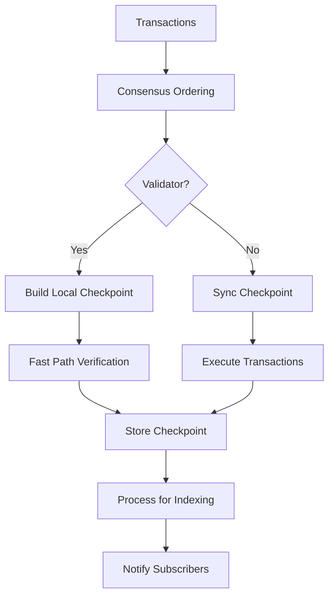

# Checkpoint Process in Sui Node

The checkpoint process in Sui nodes involves creating, executing, and storing checkpoints that contain batches of transactions. This process ensures transaction finality and enables state synchronization across the network.

## Overview

Checkpoints are periodic snapshots of the blockchain state that contain:
- Transaction digests and their effects
- Checkpoint metadata (sequence number, epoch, signatures)
- End-of-epoch data for epoch transitions

## Key Components

### 1. CheckpointExecutor

The `CheckpointExecutor` is responsible for executing all checkpoints for a given epoch<cite repo="MystenLabs/sui" path="crates/sui-core/src/checkpoints/checkpoint_executor/mod.rs" start="1-20"/>:

```rust
/// CheckpointExecutor is a Node component that executes all checkpoints for the
/// given epoch. It acts as a Consumer to StateSync
/// for newly synced checkpoints, taking these checkpoints and
/// scheduling and monitoring their execution.
```

### 2. CheckpointStore

The `CheckpointStore` manages checkpoint storage and retrieval<cite repo="MystenLabs/sui" path="crates/sui-core/src/checkpoints/mod.rs" start="786-817"/>:

```rust
pub fn insert_verified_checkpoint(
    &self,
    checkpoint: &VerifiedCheckpoint,
) -> Result<(), TypedStoreError> {
    self.insert_certified_checkpoint(checkpoint)?;
    self.update_highest_verified_checkpoint(checkpoint)
}
```

## Checkpoint Processing Flow

### 1. Checkpoint Creation (Validators Only)

Validators create checkpoints by batching transactions from consensus:

```rust
// In CheckpointBuilder::write_checkpoints
for (summary, contents) in &new_checkpoints {
    // Store checkpoint contents and summary
    batch.insert_batch(&self.store.tables.checkpoint_content, 
                      [(contents.digest(), contents)])?;
    batch.insert_batch(&self.store.tables.locally_computed_checkpoints, 
                      [(sequence_number, summary)])?;
}
```

<cite repo="MystenLabs/sui" path="crates/sui-core/src/checkpoints/mod.rs" start="1795-1848"/>

### 2. Checkpoint Execution Paths

#### For Validators (Fast Path)

Validators can skip execution if they locally built the checkpoint<cite repo="MystenLabs/sui" path="crates/sui-core/src/checkpoints/checkpoint_executor/mod.rs" start="500-523"/>:

```rust
async fn verify_locally_built_checkpoint(
    &self,
    checkpoint: VerifiedCheckpoint,
    pipeline_handle: &mut PipelineHandle,
) -> CheckpointExecutionState {
    let locally_built_checkpoint = self
        .checkpoint_store
        .get_locally_computed_checkpoint(sequence_number)?;
    
    if locally_built_checkpoint.is_some() {
        // Skip to finalization
        pipeline_handle.skip_to(PipelineStage::FinalizeTransactions).await;
    }
}
```

#### For Full Nodes (Sync Path)

Full nodes execute transactions from synced checkpoints<cite repo="MystenLabs/sui" path="crates/sui-core/src/checkpoints/checkpoint_executor/mod.rs" start="75-91"/>:

```rust
pub(crate) struct CheckpointExecutionData {
    pub checkpoint: VerifiedCheckpoint,
    pub checkpoint_contents: CheckpointContents,
    pub tx_digests: Vec<TransactionDigest>,
    pub fx_digests: Vec<TransactionEffectsDigest>,
}
```

### 3. Checkpoint Data Processing

After execution, checkpoint data is processed for indexing and storage<cite repo="MystenLabs/sui" path="crates/sui-core/src/checkpoints/checkpoint_executor/mod.rs" start="665-705"/>:

```rust
fn process_checkpoint_data(
    &self,
    ckpt_data: &CheckpointExecutionData,
    tx_data: &CheckpointTransactionData,
) -> Option<Checkpoint> {
    // Load checkpoint data
    let checkpoint = load_checkpoint(ckpt_data, tx_data, ...)?;
    
    // Index for RPC queries
    if let Some(rpc_index) = &self.state.rpc_index {
        rpc_index.index_checkpoint(&checkpoint_data, layout_resolver.as_mut());
    }
    
    // Store locally if configured
    if let Some(path) = &self.config.data_ingestion_dir {
        store_checkpoint_locally(path, &checkpoint_data)?;
    }
}
```

### 4. Node Integration

The checkpoint process is integrated into node startup and operation<cite repo="MystenLabs/sui" path="crates/sui-node/src/lib.rs" start="1852-1875"/>:

```rust
// During epoch reconfiguration
let stop_condition = checkpoint_executor.run_epoch(run_with_range).await;

if stop_condition == StopReason::RunWithRangeCondition {
    SuiNode::shutdown(&self).await;
    return Ok(());
}

// Send end-of-epoch notification
if let Err(err) = self.end_of_epoch_channel.send(latest_system_state.clone()) {
    warn!("Failed to send end of epoch notification: {:?}", err);
}
```

## Checkpoint Request Handling

Nodes handle checkpoint requests through the authority API<cite repo="MystenLabs/sui" path="crates/sui-core/src/authority.rs" start="3482-3504"/>:

```rust
pub fn handle_checkpoint_request(
    &self,
    request: &CheckpointRequest,
) -> SuiResult<CheckpointResponse> {
    let summary = match request.sequence_number {
        Some(seq) => self.checkpoint_store.get_checkpoint_by_sequence_number(seq)?,
        None => self.checkpoint_store.get_latest_certified_checkpoint()?,
    };
    // Return checkpoint summary and contents
}
```

## Summary Flow



## Notes

- Validators use a fast path when they locally built checkpoints
- Full nodes must execute all transactions from synced checkpoints
- Checkpoints provide finality guarantees through validator signatures
- The process is designed to parallelize execution within an epoch
- End-of-epoch checkpoints contain additional system state data

<cite repo="MystenLabs/sui" path="crates/sui-core/src/checkpoints/checkpoint_executor/mod.rs" start="1-20"/>
<cite repo="MystenLabs/sui" path="crates/sui-core/src/checkpoints/mod.rs" start="786-817"/>
<cite repo="MystenLabs/sui" path="crates/sui-core/src/checkpoints/mod.rs" start="1795-1848"/>
<cite repo="MystenLabs/sui" path="crates/sui-core/src/checkpoints/checkpoint_executor/mod.rs" start="500-523"/>
<cite repo="MystenLabs/sui" path="crates/sui-core/src/checkpoints/checkpoint_executor/mod.rs" start="75-91"/>
<cite repo="MystenLabs/sui" path="crates/sui-core/src/checkpoints/checkpoint_executor/mod.rs" start="665-705"/>
<cite repo="MystenLabs/sui" path="crates/sui-node/src/lib.rs" start="1852-1875"/>
<cite repo="MystenLabs/sui" path="crates/sui-core/src/authority.rs" start="3482-3504"/>
