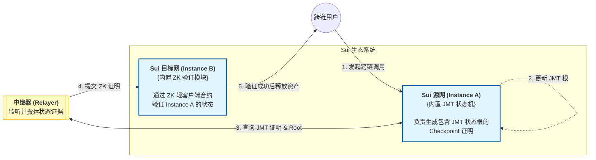

## 系统上下文

```mermaid
graph LR
    %% 定义角色
    User((跨链用户))

    %% 定义核心系统（将 JMT 视为 Sui 协议的内置功能）
    subgraph Sui_Ecosystem [Sui 生态系统]
        Sui_Source["<b>Sui 源网 (Instance A)</b><br/>{内置 JMT 状态机}<br/><br/>负责生成包含 JMT 状态根的<br/>Checkpoint 证明"]
        
        Sui_Target["<b>Sui 目标网 (Instance B)</b><br/>{内置 ZK 验证模块}<br/><br/>通过 ZK 轻客户端合约<br/>验证 Instance A 的状态"]
    end

    %% 定义外部中继组件
    Relayer[["<b>中继器 (Relayer)</b><br/>监听并搬运状态证据"]]

    %% 交互流程
    User -->|1. 发起跨链调用| Sui_Source
    Sui_Source -.->|2. 更新 JMT 根| Sui_Source
    
    Relayer <-->|3. 查询 JMT 证明 & Root| Sui_Source
    Relayer -->|4. 提交 ZK 证明| Sui_Target
    
    Sui_Target -->|5. 验证成功后释放资产| User

    %% 样式
    style Sui_Source fill:#e1f5fe,stroke:#01579b,stroke-width:2px
    style Sui_Target fill:#e1f5fe,stroke:#01579b,stroke-width:2px
    style Relayer fill:#fff9c4,stroke:#fbc02d
```
