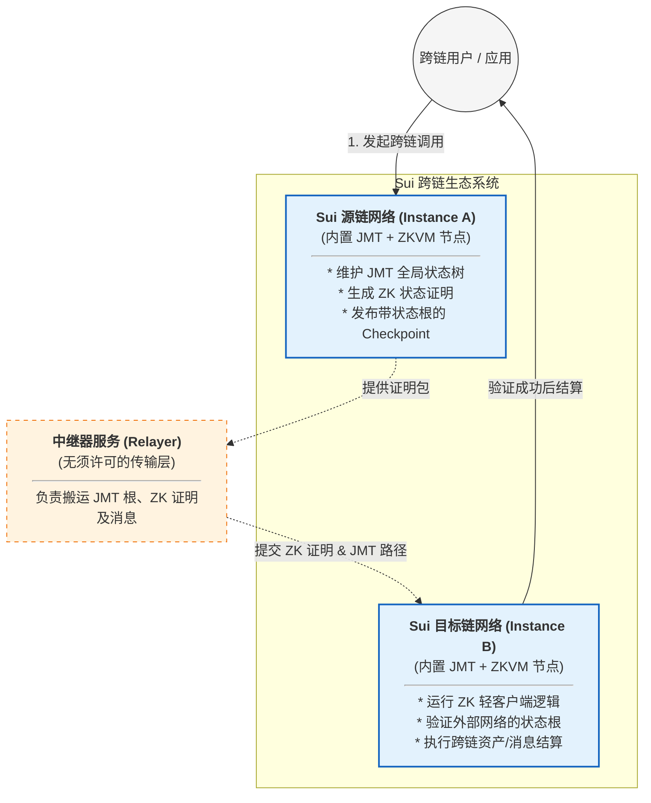
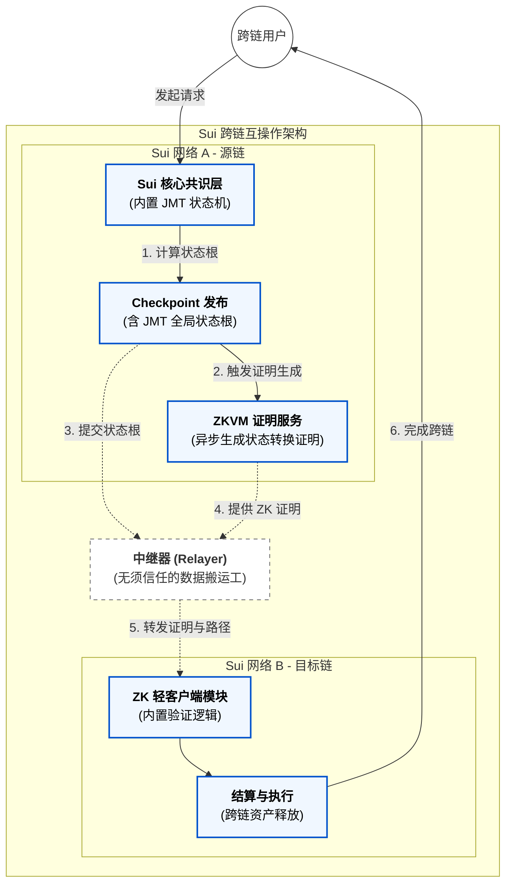

## 系统上下文

```mermaid
graph TD
    %% 定义角色
    User((跨链用户 / 应用))

    %% 定义核心系统
    subgraph Sui_Ecosystem [Sui 跨链生态系统]
        direction TB
        
        Sui_Source["<b>Sui 源链网络 (Instance A)</b><br/>(内置 JMT + ZKVM 节点)<hr/>* 维护 JMT 全局状态树<br/>* 生成 ZK 状态证明<br/>* 发布带状态根的 Checkpoint"]
        
        Sui_Target["<b>Sui 目标链网络 (Instance B)</b><br/>(内置 JMT + ZKVM 节点)<hr/>* 运行 ZK 轻客户端逻辑<br/>* 验证外部网络的状态根<br/>* 执行跨链资产/消息结算"]
    end

    %% 定义中继组件
    Relayer["<b>中继器服务 (Relayer)</b><br/>(无须许可的传输层)<hr/>负责搬运 JMT 根、ZK 证明及消息"]

    %% 定义交互流
    User -->|1. 发起跨链调用| Sui_Source
    
    Sui_Source -.->|提供证明包| Relayer
    Relayer -.->|提交 ZK 证明 & JMT 路径| Sui_Target
    
    Sui_Target -->|验证成功后结算| User

    %% 样式美化
    style Sui_Source fill:#e3f2fd,stroke:#1565c0,stroke-width:2px
    style Sui_Target fill:#e3f2fd,stroke:#1565c0,stroke-width:2px
    style Relayer fill:#fff3e0,stroke:#ef6c00,stroke-dasharray: 5 5
    style User fill:#f5f5f5,stroke:#333
```

```mermaid
graph TD
    %% 样式定义
    classDef primary fill:#f0f7ff,stroke:#0052cc,stroke-width:2px,color:#000;
    classDef secondary fill:#ffffff,stroke:#666,stroke-dasharray: 5 5,color:#333;
    classDef actor fill:#fff,stroke:#333,stroke-width:1px;

    %% 参与者
    User((跨链用户)):::actor
    
    subgraph Sui_Ecosystem [Sui 跨链互操作架构]
        direction TB

        subgraph Instance_A [Sui 网络 A - 源链]
            direction TB
            A_Core["<b>Sui 核心共识层</b><br/>(内置 JMT 状态机)"]
            A_Pub["<b>Checkpoint 发布</b><br/>(含 JMT 全局状态根)"]
            A_ZK["<b>ZKVM 证明服务</b><br/>(异步生成状态转换证明)"]
            
            %% A 内部逻辑顺序
            A_Core -->|1. 计算状态根| A_Pub
            A_Pub -->|2. 触发证明生成| A_ZK
        end

        subgraph Instance_B [Sui 网络 B - 目标链]
            B_Client["<b>ZK 轻客户端模块</b><br/>(内置验证逻辑)"]
            B_Exec["<b>结算与执行</b><br/>(跨链资产释放)"]
            
            B_Client --> B_Exec
        end

        %% 中继组件
        Relayer["<b>中继器 (Relayer)</b><br/>(无须信任的数据搬运工)"]
    end

    %% 跨网络交互流
    User -->|发起请求| A_Core
    A_Pub -.->|3. 提交状态根| Relayer
    A_ZK -.->|4. 提供 ZK 证明| Relayer
    Relayer -.->|5. 转发证明与路径| B_Client
    B_Exec -->|6. 完成跨链| User

    %% 类应用
    class A_Core,A_Pub,A_ZK,B_Client,B_Exec primary;
    class Relayer secondary;
```
