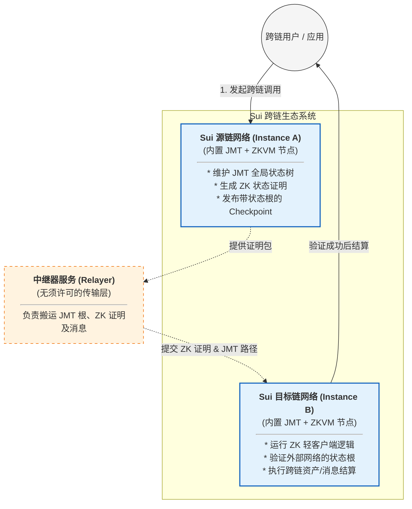

## 系统上下文

```mermaid
graph TD
    %% 定义角色
    User((跨链用户 / 应用))

    %% 定义核心系统
    subgraph Sui_Ecosystem [Sui 跨链生态系统]
        direction TB
        
        Sui_Source["<b>Sui 源链网络 (Instance A)</b><br/>(内置 JMT + ZKVM 节点)<hr/>* 维护 JMT 全局状态树<br/>* 生成 ZK 状态证明<br/>* 发布带状态根的 Checkpoint"]
        
        Sui_Target["<b>Sui 目标链网络 (Instance B)</b><br/>(内置 JMT + ZKVM 节点)<hr/>* 运行 ZK 轻客户端逻辑<br/>* 验证外部网络的状态根<br/>* 执行跨链资产/消息结算"]
    end

    %% 定义中继组件
    Relayer["<b>中继器服务 (Relayer)</b><br/>(无须许可的传输层)<hr/>负责搬运 JMT 根、ZK 证明及消息"]

    %% 定义交互流
    User -->|1. 发起跨链调用| Sui_Source
    
    Sui_Source -.->|提供证明包| Relayer
    Relayer -.->|提交 ZK 证明 & JMT 路径| Sui_Target
    
    Sui_Target -->|验证成功后结算| User

    %% 样式美化
    style Sui_Source fill:#e3f2fd,stroke:#1565c0,stroke-width:2px
    style Sui_Target fill:#e3f2fd,stroke:#1565c0,stroke-width:2px
    style Relayer fill:#fff3e0,stroke:#ef6c00,stroke-dasharray: 5 5
    style User fill:#f5f5f5,stroke:#333
```
