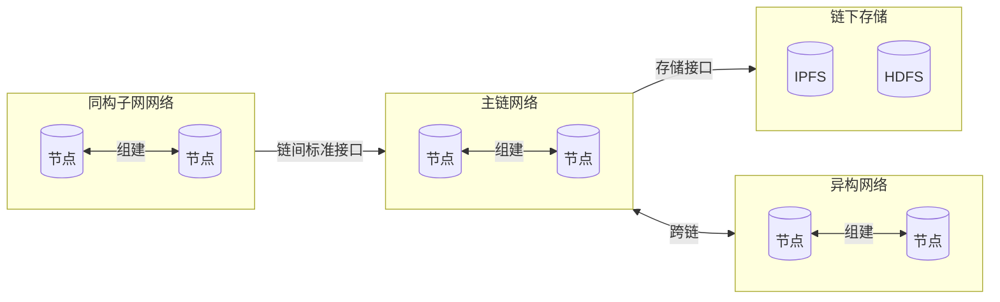
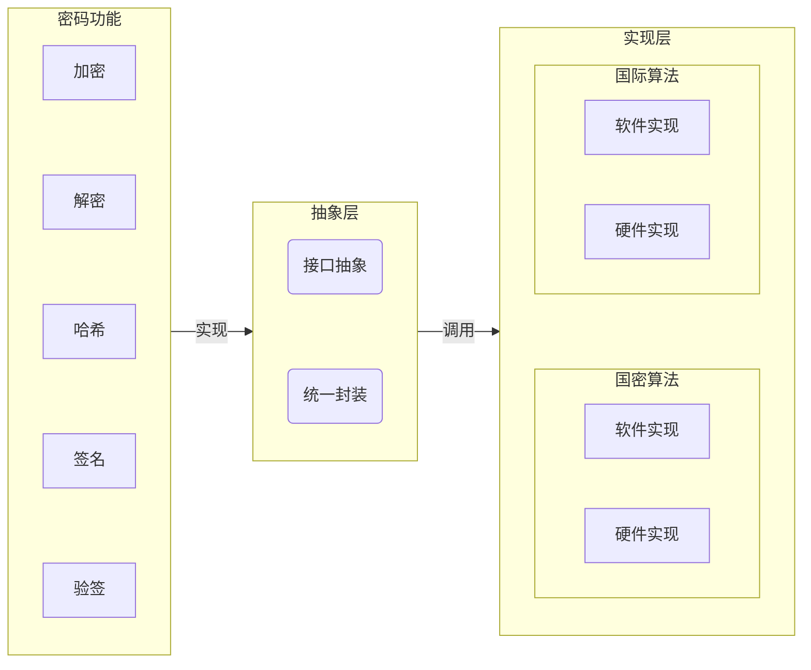

# Diagram

1. Scalable Blockchain

```mermaid
flowchart LR
    subgraph 链下存储
        R[(IPFS)]
        S[(HDFS)]
    end

    subgraph 主链网络
        direction LR 
        A[(节点)]
        B[(节点)]
        A <-- 组建 --> B
    end

    subgraph 同构子网网络
        direction LR 
        H[(节点)]
        I[(节点)]
        H <-- 组建 --> I
    end

    subgraph 异构网络
        direction LR 
        O[(节点)]
        P[(节点)]
        O <-- 组建 --> P
    end

    主链网络 --> |存储接口| 链下存储
    同构子网网络 --> |链间标准接口| 主链网络
    主链网络 <-- 跨链 --> 异构网络
```

2. Editable Blockchain

```mermaid
flowchart LR
    subgraph 密码功能
        direction TB
        A[加密]
        B[解密]
        C[哈希]
        D[签名]
        E[验签]
        A ~~~ B ~~~ C ~~~ D ~~~ E
    end

    subgraph 抽象层
        F(接口抽象)
        G(统一封装)
        F ~~~ G
    end

    subgraph 实现层

        subgraph 国际算法
            H[软件实现]
            I[硬件实现]
        end

        subgraph 国密算法
            J[软件实现]
            K[硬件实现]
        end

        国际算法 ~~~ 国密算法

    end

    密码功能 --> |实现| 抽象层 --> |调用| 实现层

```

